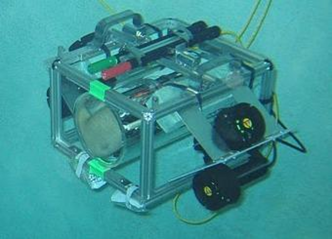
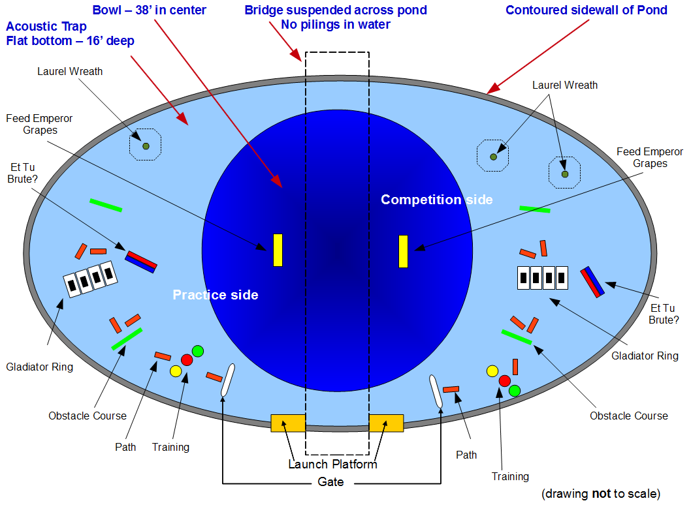
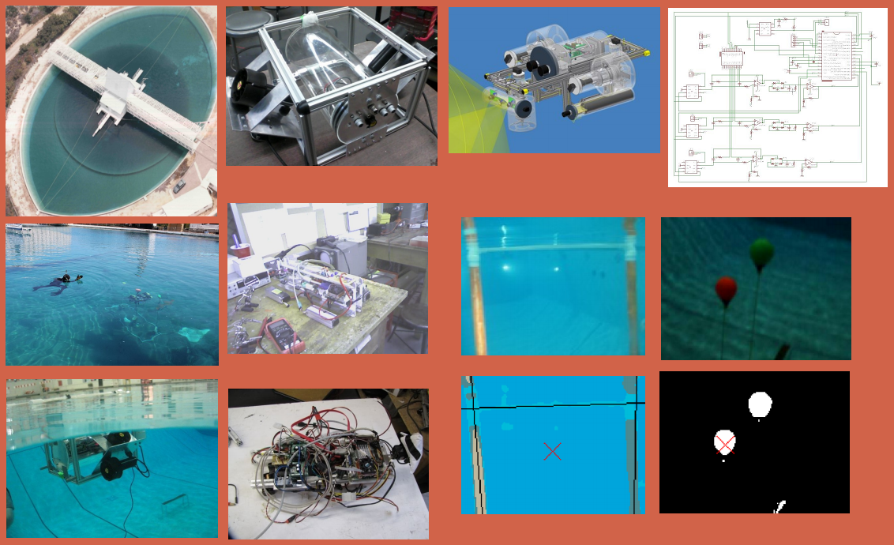
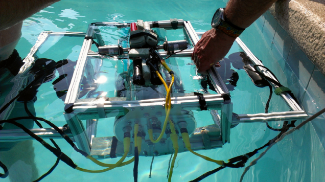

# __Virginia Tech Autonomous Underwater Vehicle Team (AUVT)__

## Overview

Each July, engineering teams from around the world gather at TRANSDEC for the annual RoboSub competition. This event, hosted by Autonomous Underwater Vehicle Systems International (AUVSI), features an underwater obstacle course through which vehicles are expected to navigate. Control systems must perform all tasks without human intervention.

Virginia Tech has been involved in the RoboSub competition for many years. Building on the knowledge and experience of members from previous years, the 2012 team hopes to construct a robust system to execute all autonomous tasks. The team is positioned to greatly improve performance over previous events, in large part due to the efforts of each subteam thus far. The 2011 AUV was able to drive in a controlled manner, fire torpedos, and drop projectiles. The 2012 AUV has been re-designed with robustness as a key goal. The team intends to complete all of the tasks this year, and with the addition of SONAR, Mako II (our vehicle) should perform much better. 

This repository contains documentation of the Virginia Tech AUVT design effort in 2012. Although the vehicle's code has been archived and planned for inclusion in this repository, it is not currently available.

